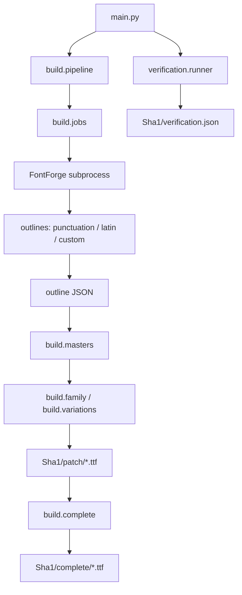

# Sha1字体补丁构建文档

字形需求以[根目录README](../README.md)为准，本文记录实现、构建和验证方式

字体版本在构建时由`SHA1_RELEASE_NUMBER`传入：发布工作流的第`N`次运行生成字体版本`N.000`和Release标签`vN`，本地构建默认版本为`0.000`。自定义艺术字`O`和原生Italic样式以根目录README为准

## 快速开始

从仓库根目录运行：

```sh
uv run --project src python src/main.py
uv run --project src python -m unittest discover -s src/tests -t src
```

构建需要Python3.14+、`uv`和带Python脚本支持的FontForge。构建进程调用`PATH`中的`fontforge`，普通Python环境只需安装fontTools，无需安装FontForge的Python模块

本次使用FontForge20251009和fontTools4.65.0完成构建与验证，Python依赖锁定于[uv.lock](uv.lock)

完整构建会自动验证生成字体。也可单独验证已有产物，或复用兼容的轮廓缓存重新合成字体：

```sh
uv run --project src python src/main.py verify
uv run --project src python src/main.py --reuse-outlines
```

中间供体、轮廓JSON、任务文件和FontForge日志位于`temp/build/`。轻量补丁位于`Sha1/patch/`，完整字体位于`Sha1/complete/`，清单、验证报告和派生字体许可证分别位于`Sha1/manifest.json`、`Sha1/verification.json`和`Sha1/OFL.txt`

缓存任务包含`outline_design_version`。字符集、构造斜体列表、轮廓设计版本或标点参数不匹配时，复用构建和单独验证都会拒绝旧缓存，需运行一次完整构建

## 轻量补丁发布字体

| 文件 | 字重 | 字宽 | 命名实例 | 编码字符 |
| --- | --- | --- | --- | --- |
| `Sha1SansPatch-VariableFont_wdth,wght.ttf` | 100–900 | 62.5–100% | 36 | 20 |
| `Sha1SansPatch-Italic-VariableFont_wdth,wght.ttf` | 100–900 | 62.5–100% | 36 | 11 |
| `Sha1SansMonoPatch-VariableFont_wdth,wght.ttf` | 100–900 | 62.5–100% | 36 | 21 |
| `Sha1SerifPatch-VariableFont_wdth,wght.ttf` | 200–900 | 62.5–100% | 32 | 15 |
| `Sha1SerifPatch-Italic-VariableFont_wdth,wght.ttf` | 200–900 | 62.5–100% | 32 | 6 |

命名字重每隔100取样，字宽取62.5、75、87.5和100，默认位置为`wght=400, wdth=100`。Serif从200开始，与仓库中的SC供体范围一致。Mono不构建Italic字体

字体只编码补丁字符，另有未编码的`.notdef`；其余字符由根目录README中的字体栈回退。Italic文件只覆盖拉丁补丁，中文标点从直立Patch回退

## 完整发布字体

| 文件 | 字重 | 字宽 | 编码字符 |
| --- | --- | --- | --- |
| `Sha1Sans-VariableFont_wdth,wght.ttf` | 100–900 | 62.5–100% | Sha1 Sans Patch、Noto Sans、Noto Sans SC的有效并集 |
| `Sha1Sans-Italic-VariableFont_wdth,wght.ttf` | 100–900 | 62.5–100% | Sha1 Sans Patch、Noto Sans Italic的有效并集 |
| `Sha1SansMono-VariableFont_wdth,wght.ttf` | 100–900 | 62.5–100% | Sha1 Sans Mono Patch、Noto Sans Mono、Noto Sans SC的有效并集 |
| `Sha1Serif-VariableFont_wdth,wght.ttf` | 200–900 | 62.5–100% | Sha1 Serif Patch、Noto Serif、Noto Serif SC的有效并集 |
| `Sha1Serif-Italic-VariableFont_wdth,wght.ttf` | 200–900 | 62.5–100% | Sha1 Serif Patch、Noto Serif Italic的有效并集 |

完整字体以对应Noto拉丁变量字体为底，Patch字形覆盖同码位来源。直立样式补入SC中拉丁来源没有映射的码位，故保留原字体栈的优先级；Italic不合并SC。SC来源的字重轴默认值不是400，构建时会将其默认轮廓与差分重定基准到完整字体的`wght=400`，再生成向轻和向重的两段差分

## 字形实现

| 字形 | 实现 |
| --- | --- |
| Sans的`l` | 从对应命名字重的Noto Sans SC静态字体复制轮廓和步进，在字重轴上插值；SC字形不随字宽轴压缩 |
| Mono的`l` | 保留Noto Sans Mono的上部、竖干、右下横脚和步进，仅将左下横脚收回到竖干左边缘 |
| Sans的`1` | 沿Noto Sans原生竖干构造实心尖顶旗头和短底横，步进缩至85%，两侧各收回一半差值；Italic使用原生斜体的竖干厚度与倾角 |
| Mono的`1` | 沿Noto Sans Mono原生竖干构造同样的实心尖顶旗头，原底横围绕自身中心缩短至80%，保留底横高度和等宽步进 |
| Serif的`1` | 在Noto Serif原生直立或斜体轮廓上构造实心尖顶旗头，下缘通过二次曲线圆滑接入竖干；底部沿用原生衬线曲线，两侧相对竖干的外伸长度各收回20%，保留高度和步进 |
| 三个家族的`0` | 分别保留Noto Sans、Noto Sans Mono、Noto Serif的零的内外轮廓和步进；移除Mono原有斜线，在字腔中心加入同一来源、同一轴位置的英文句点 |
| 三个家族的`O` | 以本家族、同一样式的原生圆环为底形，改为右上开口、向字腔伸入的斜笔及连接右侧圆弧的弯钩；保留原步进，Sans和Serif覆盖Italic |
| 三个家族的`\|` | 延伸至来源字体的`hhea.ascent`与`hhea.descent`，占满升降部高度；保持竖干横向位置、宽度和步进，并添加突出竖干的居中实心圆 |
| `-`、`…` | 仅沿垂直方向平移，使轮廓中心与同一家族、同一样式的`>`对齐，保留形状和步进 |
| Sans的`‘’“”` | 使用匹配字重、字宽和样式的Noto Serif轮廓与步进 |
| Mono的`‘’“”` | 使用Noto Serif轮廓，在Mono字格内居中，必要时横向压缩并设置Mono步进 |
| Mono的`—` | 从匹配字重和字宽的Noto Sans复制完整轮廓和原步进，不强制压缩到Mono字格 |

点零的句点按需等比缩小：根据圆点高度范围内的字腔空间限制尺寸，使窄体和重字重的点仍与侧壁分离。内外轮廓不会因加点而缩放

数字`1`的旗头向左突出，上边缘直接斜接到竖干右侧的唯一顶点，形成没有水平顶边或接缝台阶的实心三角。Sans和Mono使用主体与底横两个轮廓，Serif把旗头和原生衬线合为一个轮廓；各样式在整个字重和字宽网格内保持节点兼容。实心填充、唯一顶点、原生竖干、底横或衬线以及步进在命名及中间插值位置独立核验，完整字体另核对`1`的轮廓和步进与Patch一致

旗头仅沿水平方向向左加宽，外伸长度至少达到底横左侧外伸的90%；已有更宽的旗头保持原宽。长度在去除Italic倾角的坐标中测量，旗尖高度、顶部和下缘连接高度、底横、竖干及步进均保持不变

满高竖线的上下边界取排版升降部度量，不取FontForge内部拆分em方框的`ascent`与`descent`。当前所有来源均为顶部1069、底部−293，圆心位于388；原生Italic中的竖线仍沿用来源的直立笔画

Sans和Serif的Italic点零直接使用各自的原生Italic零和句点。只有Sans的SC`l`缺少原生斜体来源，需要按Noto Sans Italic的倾斜角度围绕字形高度中心切变，保留步进和节点拓扑

### 中文标点

中文供体来自对应家族、对应命名字重的SC静态文件。使用文件名识别字重，避免部分Thin/ExtraLight文件的`usWeightClass=250`影响选择

- `：；！？`的实心点替换为空心圆，内外宽高取同字重SC的`。`，采用固定八段二次曲线
- `！？`的主体上移至同字重SC的`中`的顶部，空心圆中心相对原点中心下移16单位
- `，；！？`的实心部分沿外法线加粗，增量取`。`的平均环壁厚度，保持加粗前的水平中心和垂直范围，再施加主体位移
- `、。，：；！？`的完整轮廓向右移动原步进的1/8，保留1000单位步进，不随字宽轴压缩
- `（）`的步进由1000缩减为667，仅裁去外侧空白：左括号平移−333单位，右括号保持原位置，原曲线不横向缩放
- 括号横线位于主笔画的垂直中心，从缩减后字格的1/5或4/5位置连接到该高度的主笔画中心，端点分别约为133.4和533.6

### 自定义艺术字`O`

生成入口为[outlines/custom.py](outlines/custom.py)中的`patch_o(target, base, job)`，在常规拉丁补丁之后调用，替换原来的“O加居中句点”占位设计

- 圆环沿用对应家族、字重、字宽与样式的原生`O`比例和笔画对比，长弧按固定40段二次曲线重采样
- 斜笔从字腔左上方伸向右上，穿过圆环并略高于顶线；其粗细随原生横笔变化，在窄体和重字重下根据字腔尺寸限宽
- 右上弧改为平滑弯钩，与斜笔之间保留开口，字腔中心保持空白
- Sans和Serif的Italic直接取原生Italic圆环，在消除倾角的设计坐标中添加笔画后恢复倾角，保留原生斜体的比例和笔画粗细分布
- 所有位置统一为内外两个闭合轮廓，每个轮廓99个节点，不使用会改变节点数量的布尔合并，保证字重和字宽轴插值兼容
- 保留来源步进，Mono仍为对应字宽位置的等宽字格；`O`无需加入构造斜体列表

独立验证入口为[verification/custom.py](verification/custom.py)中的`check_o`，用fontTools测量实际曲线和填充，核验原生圆环、轮廓方向、空字腔、斜笔长度和端面粗细、斜笔连通、右上留白及步进。命名位置和网格中间位置均执行这些约束

当前`lib.OUTLINE_DESIGN_VERSION`为6，旧旗头宽度的轮廓缓存会被拒绝。后续修改设计时应同步更新生成、独立验证与轮廓版本，并完整重建字体

## 构建流程与源码



`temp/build/jobs.json`通过`BuildJob`字典连接普通Python进程与FontForge进程。每个输出JSON条目包含`width`和由`[x, y, on_curve]`组成的轮廓

FontForge导出原始二次曲线节点，fontTools按相同点序构建TrueType母版，拒绝拓扑不一致的母版，再生成`fvar`、`gvar`、`HVAR`和`STAT`。命名位置与各自母版一致，中间位置采用相邻网格的双线性插值

重叠轮廓保留TrueType重叠标志，字体不含提示信息。原始Noto文件和许可证保持不变，派生字体使用Sha1家族和PostScript名称，`name`表版本与`head.fontRevision`均记录传入的发布版本。单独验证时从构建清单读取版本

| 模块 | 负责内容 |
| --- | --- |
| [main.py](main.py) | 构建、单独验证和FontForge任务入口 |
| [lib.py](lib.py) | 家族、字符集、版本、路径、来源实例和许可证 |
| [build/jobs.py](build/jobs.py)、[build/pipeline.py](build/pipeline.py) | 供体选择、缓存校验和构建编排 |
| [build/masters.py](build/masters.py)、[build/family.py](build/family.py)、[build/variations.py](build/variations.py) | 补丁母版、拓扑、可变字体和插值差分 |
| [build/complete.py](build/complete.py) | 叠加Patch、补入SC字形并重定基准SC字重差分 |
| [outlines/pipeline.py](outlines/pipeline.py) | FontForge供体管理与轮廓导出 |
| [outlines/latin.py](outlines/latin.py)、[outlines/punctuation.py](outlines/punctuation.py) | 拉丁和中文标点修改 |
| [outlines/custom.py](outlines/custom.py)、[verification/custom.py](verification/custom.py) | 艺术字`O`生成与独立核验 |
| [outlines/geometry.py](outlines/geometry.py)、[outlines/transforms.py](outlines/transforms.py) | 基础轮廓、加粗、复制、对齐和倾斜 |
| [verification/runner.py](verification/runner.py)、[verification/metadata.py](verification/metadata.py)、[verification/complete.py](verification/complete.py) | 验证编排、发布清单、完整字体覆盖、元数据和HarfBuzz整形 |
| [verification/instances.py](verification/instances.py)、[verification/interpolation.py](verification/interpolation.py) | 命名位置和中间位置验证 |
| [verification/latin.py](verification/latin.py)、[verification/punctuation.py](verification/punctuation.py)、[verification/geometry.py](verification/geometry.py) | 独立几何检查 |
| [verification/styles.py](verification/styles.py) | 原生斜体、构造斜体和400/700字重表现 |
| [tests/test_jobs.py](tests/test_jobs.py)、[tests/test_runtime_boundaries.py](tests/test_runtime_boundaries.py)、[tests/test_readme_contract.py](tests/test_readme_contract.py) | 缓存、进程边界和字形回归测试 |

仅`outlines`依赖FontForge运行时。普通构建、验证和测试模块只依赖fontTools，验证器不导入FontForge字形算法

## 验证结果

本次通过以下检查：

- 5个发布字体，共172个命名实例和114个中间插值位置
- 各命名位置的轮廓拓扑、坐标、步进、裁剪边界，以及全部README字形约束
- 各中间位置的双线性轮廓和步进插值，以及艺术字`O`、旗头数字`1`和满高竖线的独立几何约束
- 5个样式各98个拉丁字符的字体回退及400/700字重表现；源设计允许下划线保持固定笔画
- HarfBuzz对每个字体的浅、常规、重位置整形，检查补丁字符无缺字
- 原始字体和许可证哈希保持不变
- 单元与回归测试覆盖艺术字`O`的五个样式、旧圆点占位和普通圆环、错误的Mono步进与直立Italic，以及旧缓存、点零来源、旗头数字`1`、满高竖线和破折号回归
- 全部286个命名及中间位置的`O`经独立多边形检查，无自交或字腔越界
- 与本次实心旗头调整前的发布字体比较，全部172个命名位置仅新增或修改`1`：Sans步进缩小15%，Mono保留等宽步进，Serif新增直立和Italic覆盖；其他字形轮廓和步进保持一致

回归测试读取`Sha1/`中的本地构建字体和仓库中的Noto来源，首次克隆或修改字形代码后应先构建再运行测试。验证报告生成于`Sha1/verification.json`，发布时按系列分别包含在对应压缩包中

代码检查从`src/`运行：

```sh
cd src
ty check && ruff check . --fix && ruff format .
```

## 浏览器预览

从仓库根目录启动服务：

```sh
uv run --project src python -m http.server 8765 --bind 127.0.0.1
```

打开[预览页面](http://127.0.0.1:8765/preview.html)或[样式回归页面](http://127.0.0.1:8765/src/tests/styles.html)。回归页面通过iframe加载真实预览，展示普通、Italic、Bold和Bold Italic样式，并转发字体合成和可变设置开关

CSS注册方式见[preview.html](../preview.html)。Sans和Serif分别注册直立与Italic文件，Mono仅注册直立文件。额外的`Patch Upright`名称是指向直立文件的CSS别名，用于Italic样式下的中文标点回退，并非额外字体文件

Fix字体可变设置会为各元素明确设置计算所得的字重和字宽，普通文本保持400，`strong`保持700。允许字体合成时，缺少原生Italic的字形可由浏览器合成；禁用时使用其直立轮廓
